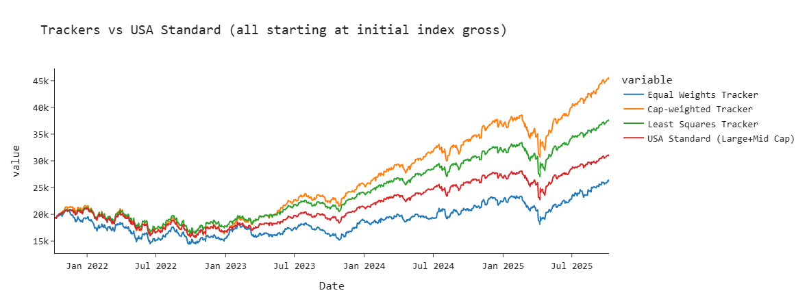
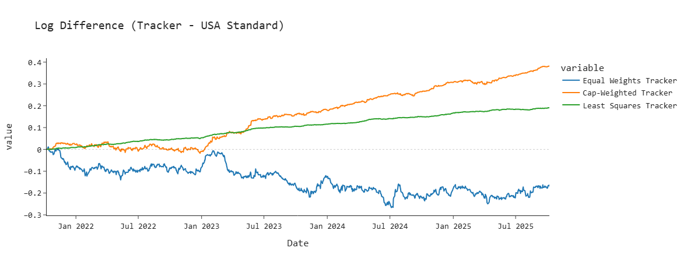

# Index Replication with Python

This project replicates the performance of equity indices using daily price data for ≈4,000 stocks (4 years) sourced via `yfinance` and Nasdaq listings. The goal is to evaluate how well simple indexing heuristics track an MSCI-style index and whether optimization improves tracking.

## Overview
- Data: daily adjusted prices for ~4,000 stocks (4 years) filtered down from ~6,000 listed symbols. Data cleaning and missing-value handling are implemented.
- Methods compared:
  - **Naïve trackers**: equal-weighted and market-cap-weighted portfolios.
  - **Least-squares replication**: regression-style portfolio construction solved with **cvxpy** (convex optimization) to minimize squared tracking error.
- Evaluation: MAE and MSE, value vs. index plots, and log-value difference visualizations.

## Key results
- The least-squares replication closely tracks the benchmark index, outperforming both naïve trackers in cumulative value.
- Below: index vs tracker performance (normalized values):



- Additionally: log difference performance:




## How to run (local)
1. **Clone the repository and enter the folder**
   ```bash
   git clone https://github.com/<yourusername>/index-replication-msci.git
   cd index-replication-msci
   ```

2. **Create and activate the environment using uv**

   ```bash
   uv sync
   uv run jupyter lab
   ```

2. Open `procurement.ipynb` and run cells in order (data download may take upwards of an hour).
  - Note: The project uses publicly available but not redistributable MSCI index data in the form of Excel files not present in the repo. 
4. See `analysis.ipynb` for replication steps and plots.

## Files / structure
- `procurement.ipynb` — data collection / cleaning pipeline.
- `analysis.ipynb` — modeling, optimization (cvxpy), and performance plots.
- `pyproject.toml` — Python dependencies.
- `data/` — processed data exported.

## Future work
- Add turnover penalty and rebalancing to the optimization objective.
- Constrain for integer/non-fractional shares and test transaction-cost-aware strategies.
- Expand comparisons to additional indices and perform cross-validation.


